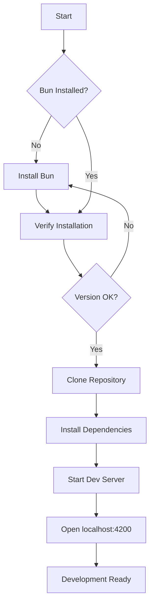
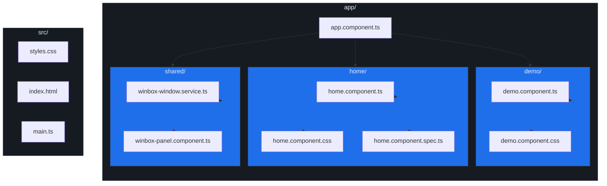

# Getting Started

This guide will help you set up and run the Angular Rspack Demo project on your local machine.

## Table of Contents

- [Prerequisites](#prerequisites)
- [Installation](#installation)
- [Development](#development)
- [Building](#building)
- [Troubleshooting](#troubleshooting)

## Prerequisites

### Required Software

| Software | Version | Purpose | Download |
|----------|---------|---------|----------|
| **Bun** | 1.0+ | Runtime and Package Manager | [bun.sh](https://bun.sh/) |
| **Git** | Latest | Version Control | [git-scm.com](https://git-scm.com/) |

### Optional Software

| Software | Version | Purpose |
|----------|---------|---------|
| Node.js | 18+ | Fallback runtime |
| VS Code | Latest | Recommended IDE |

### Setup Flow



### Installing Bun

**macOS/Linux:**
```bash
curl -fsSL https://bun.sh/install | bash
```

**Windows:**
```powershell
powershell -c "irm bun.sh/install.ps1 | iex"
```

**Verify Installation:**
```bash
bun --version
```

## Installation

### 1. Clone the Repository

```bash
git clone <repository-url>
cd starter-web-angular-rspack
```

### 2. Install Dependencies

```bash
bun install
```

This will install:
- Angular 19.x
- Rspack
- Biome (linter)

### 3. Start Development Server

```bash
bun run dev
```

The application will start at `http://localhost:4200`

**Features:**
- Hot Module Replacement (HMR)
- Live reload on file changes
- Source maps for debugging
- Automatic port selection (if 4200 is busy)

## Development

### Project Structure



### Development Workflow

#### Running Tests

```bash
# Run once
bun run test

# Watch mode
bun run test:watch

# With coverage
bun run test:coverage
```

#### Linting & Formatting

```bash
# Auto-fix issues
bun run lint

# Check only
bun run lint:check

# Format code
bun run format
```

#### E2E Testing

```bash
# Install Playwright browsers
bunx playwright install

# Run E2E tests
bun run e2e
```

## Building

### Development Build

```bash
bun run rspack serve
```

### Production Build

```bash
bun run build:rspack
```

**Build Process:**
1. Rspack compiles TypeScript → JavaScript
2. Processes SCSS/CSS → optimized CSS
3. Bundles all assets
4. Copies WinBox.js files
5. Copies Prism.js files
6. Outputs to `dist/angular-rspack-demo/`

### Serving Production Build

```bash
# Option 1: Use the serve script
bun run serve:rspack

# Option 2: Use any static file server
cd dist/angular-rspack-demo
bunx serve
```

## Troubleshooting

### Port Already in Use

**Error:** `Port 4200 is in use`

**Solution:** The dev server will automatically find an available port. You can also specify:

```bash
PORT=4201 bun run dev
```

### Prism.js Not Loading

**Error:** `Prism is not defined`

**Solution:**
```bash
# Re-run setup
bun run setup:prism

# Restart dev server
bun run dev
```

### WinBox Windows Not Appearing

**Possible Causes:**
1. WinBox.js not loaded
2. Browser console errors
3. Z-index conflicts

**Solution:**
```bash
# Check public folder
ls public/prism/

# Verify index.html has scripts
cat src/index.html
```

### TypeScript Errors

**Error:** `Cannot find module...`

**Solution:**
```bash
# Reinstall dependencies
rm -rf node_modules bun.lock
bun install

# Clear TypeScript cache
rm -rf .angular/cache
```

### Build Fails

**Common Issues:**

1. **Missing dependencies:**
   ```bash
   bun install
   ```

2. **Cache issues:**
   ```bash
   rm -rf dist node_modules/.cache
   bun run build:rspack
   ```

3. **Rspack config error:**
   ```bash
   # Validate config
   node -e "require('./rspack.config.js')"
   ```

## Next Steps

- Read the [Architecture Guide](./02-architecture.md) to understand the project structure
- Check out the [WinBox Panel Guide](./03-winbox-panel.md) for window management details
- Review the [Styling Guide](./05-styling.md) for CSS customization

## Additional Resources

- [Angular Documentation](https://angular.io/docs)
- [Rspack Documentation](https://rspack.dev/)
- [Bun Documentation](https://bun.sh/docs)
- [WinBox.js Documentation](https://winbox.krawaller.se/)
- [Prism.js Documentation](https://prismjs.com/)
