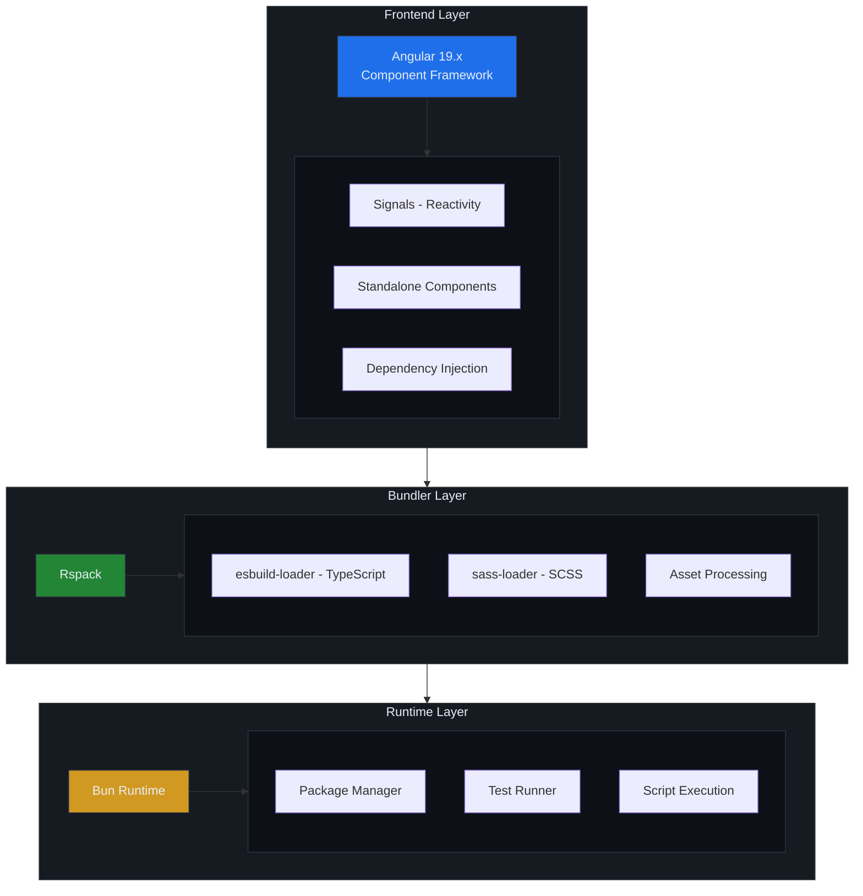
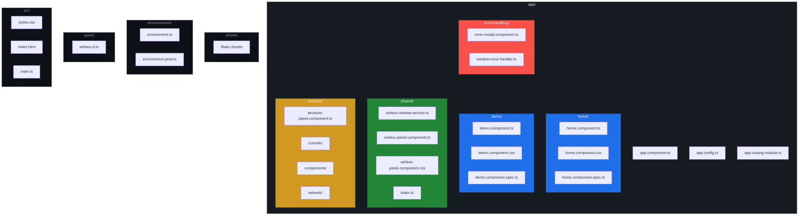

# Architecture

This document describes the application architecture, design patterns, and technical decisions.

## Table of Contents

- [Overview](#overview)
- [Application Structure](#application-structure)
- [Component Architecture](#component-architecture)
- [State Management](#state-management)
- [Routing](#routing)
- [Build System](#build-system)
- [Design Patterns](#design-patterns)

## Overview

### Technology Stack



### Key Design Decisions

| Decision | Rationale |
|----------|-----------|
| **Standalone Components** | Simpler, no NgModules needed |
| **Signals** | Modern reactivity, better performance |
| **Rspack** | 10-100x faster than Webpack |
| **Bun** | Faster installs, native test runner |
| **Inline Templates** | Co-located template and logic |
| **External CSS** | Separated styles for maintainability |

## Application Structure

### High-Level Architecture

```
┌─────────────────────────────────────────────────────────────┐
│                        Browser                              │
├─────────────────────────────────────────────────────────────┤
│  ┌───────────────────────────────────────────────────────┐  │
│  │                   App Component                       │  │
│  │  ┌─────────────────┐  ┌─────────────────────────────┐ │  │
│  │  │  WinBox Panel   │  │      Router Outlet          │ │  │
│  │  │  (Fixed Top)    │  │  ┌───────────────────────┐  │ │  │
│  │  │  - Header Row   │  │  │   Home Component      │  │ │  │
│  │  │  - Tabs Row     │  │  │   - Card List         │  │ │  │
│  │  └─────────────────┘  │  │   - Search            │  │ │  │
│  │                       │  │   - WinBox Creator    │  │ │  │
│  │  WinBox Windows       │  └───────────────────────┘  │ │  │
│  │  ┌─────────────────┐  │  ┌───────────────────────┐  │ │  │
│  │  │  Window 1       │  │  │   Demo Component      │  │ │  │
│  │  │  - Title Bar    │  │  │   - Tech Cards        │  │ │  │
│  │  │  - Content      │  │  │   - WinBox Creator    │  │ │  │
│  │  └─────────────────┘  │  └───────────────────────┘  │ │  │
│  └───────────────────────────────────────────────────────┘  │
└─────────────────────────────────────────────────────────────┘
```

### File Organization



## Component Architecture

### Component Types

#### 1. **Page Components** (Home, Demo)
- Full-page components
- Route targets
- Own their data and state

```typescript
@Component({
  selector: 'app-home',
  standalone: true,
  imports: [FormsModule, RouterLink],
  templateUrl: './home.component.html',  // Inline template
  styleUrls: ['./home.component.css'],    // External CSS
})
export class HomeComponent {
  // Component logic
}
```

#### 2. **Shared Components** (WinBoxPanel)
- Reusable across the app
- No route targets
- Input/Output based

```typescript
@Component({
  selector: 'app-winbox-panel',
  standalone: true,
  imports: [CommonModule, FormsModule],
  templateUrl: './winbox-panel.component.html',
  styleUrls: ['./winbox-panel.component.css'],
})
export class WinBoxPanelComponent {
  // Shared logic
}
```

#### 3. **Smart vs Presentational**

| Smart Components | Presentational Components |
|-----------------|---------------------------|
| Home, Demo | WinBoxPanel |
| Manage state | Receive data via inputs |
| Inject services | Emit events via outputs |
| Route targets | Reusable |

### Component Communication

```mermaid
flowchart LR
    subgraph Services["Service Layer"]
        direction TB
        S1["Service 1<br/>(Singleton)"]
        S2["Service 2<br/>(Singleton)"]
    end
    
    subgraph Components["Component Layer"]
        direction TB
        C1["Smart Component<br/>(Home/Demo)"]
        C2["Shared Component<br/>(WinBoxPanel)"]
    end
    
    S1 -->|inject()| C1
    S2 -->|inject()| C1
    S1 -->|inject()| C2
    C1 -->|Inputs| C2
    C2 -->|Outputs| C1
    
    style Services fill:#161b22,stroke:#30363d,color:#e6edf3
    style Components fill:#161b22,stroke:#30363d,color:#e6edf3
    style S1 fill:#238636,stroke:#30363d,color:#e6edf3
    style S2 fill:#238636,stroke:#30363d,color:#e6edf3
    style C1 fill:#1f6feb,stroke:#30363d,color:#e6edf3
    style C2 fill:#d29922,stroke:#30363d,color:#e6edf3
```

## State Management

### Signal-Based Reactivity

```typescript
import { signal, computed } from '@angular/core';

export class WinBoxWindowService {
  // Writable signal
  private windows = signal<WinBoxWindow[]>([]);
  
  // Computed signal (read-only, auto-updates)
  windowsList = computed(() => this.windows());
  
  // Derived computed signal
  hasWindows = computed(() => this.windows().length > 0);
  
  // Update signal
  addWindow(window: WinBoxWindow) {
    this.windows.update(windows => [...windows, window]);
  }
}
```

### Service Architecture

```
┌─────────────────────────────────────────────────────────────┐
│                     Service Layer                           │
├─────────────────────────────────────────────────────────────┤
│                                                             │
│  WinBoxWindowService (Singleton)                            │
│  ├── windows: Signal<WinBoxWindow[]>                        │
│  ├── activeWindowId: Signal<string | null>                  │
│  ├── allHidden: Signal<boolean>                             │
│  │                                                          │
│  ├── createWindow(options): WinBoxWindow                    │
│  ├── setActiveWindow(id): void                              │
│  ├── minimizeWindow(id): void                               │
│  ├── restoreWindow(id): void                                │
│  ├── hideAll(): void                                        │
│  ├── showAll(): void                                        │
│  └── toggleAll(): void                                      │
│                                                             │
└─────────────────────────────────────────────────────────────┘
```

## Routing

### Route Configuration

```typescript
const routes: Routes = [
  {
    path: '',
    redirectTo: 'home',
    pathMatch: 'full'
  },
  {
    path: 'home',
    loadComponent: () => import('./home/home.component')
      .then(m => m.HomeComponent)
  },
  {
    path: 'demo',
    loadComponent: () => import('./demo/demo.component')
      .then(m => m.DemoComponent)
  },
  {
    path: '**',
    redirectTo: 'home'
  }
];
```

### Lazy Loading

```typescript
// Components are lazy-loaded on navigation
loadComponent: () => import('./home/home.component')
  .then(m => m.HomeComponent)
```

**Benefits:**
- Smaller initial bundle
- Faster initial load
- On-demand loading

## Build System

### Rspack Configuration

```javascript
module.exports = {
  mode: 'development' | 'production',
  entry: './src/main.ts',
  output: {
    path: './dist/angular-rspack-demo',
    filename: '[name].[contenthash].js',
  },
  module: {
    rules: [
      {
        test: /\.ts$/,
        use: 'esbuild-loader',  // Fast TypeScript compilation
      },
      {
        test: /\.scss$/,
        use: ['style-loader', 'css-loader', 'sass-loader'],
      },
    ],
  },
  plugins: [
    new HtmlRspackPlugin({ template: './src/index.html' }),
  ],
};
```

### Build Pipeline

```mermaid
flowchart LR
    subgraph Source["Source Files"]
        TS["*.ts"]
        CSS["*.css"]
        SCSS["*.scss"]
        HTML["*.html"]
    end
    
    subgraph Rspack["Rspack Processing"]
        direction TB
        TS2TS["TypeScript →<br/>esbuild-loader → JavaScript"]
        SCSS2CSS["SCSS →<br/>sass-loader → CSS"]
        HTML2HTML["HTML →<br/>html-rspack-plugin → HTML"]
        ASSETS["Assets →<br/>Asset modules"]
    end
    
    subgraph Optimization["Optimization"]
        direction TB
        TreeShaking["Tree Shaking"]
        Minify["Minification"]
        Splitting["Code Splitting"]
    end
    
    subgraph Output["Output Files"]
        MAIN["main.[hash].js"]
        STYLES["styles.[hash].css"]
        INDEX["index.html"]
        ASSETS_OUT["assets/"]
    end
    
    Source --> Rspack
    Rspack --> Optimization
    Optimization --> Output
    
    style Source fill:#161b22,stroke:#30363d,color:#e6edf3
    style Rspack fill:#1f6feb,stroke:#30363d,color:#e6edf3
    style Optimization fill:#238636,stroke:#30363d,color:#e6edf3
    style Output fill:#161b22,stroke:#30363d,color:#e6edf3
    style TS2TS fill:#0d1117,stroke:#30363d,color:#8b949e
    style SCSS2CSS fill:#0d1117,stroke:#30363d,color:#8b949e
    style HTML2HTML fill:#0d1117,stroke:#30363d,color:#8b949e
    style ASSETS fill:#0d1117,stroke:#30363d,color:#8b949e
```



## Design Patterns

### 1. **Service Pattern**
Singleton services for shared state and logic.

```typescript
@Injectable({ providedIn: 'root' })
export class WinBoxWindowService {
  // Singleton instance
  // Shared across all components
}
```

### 2. **Signal Pattern**
Reactive state management with Angular Signals.

```typescript
// State
private count = signal(0);

// Computed
readonly doubleCount = computed(() => this.count() * 2);

// Update
this.count.update(c => c + 1);
```

### 3. **Component Composition**
Building complex UIs from simple components.

```
App Component
├── WinBoxPanel (shared)
├── RouterOutlet
│   ├── Home Component
│   └── Demo Component
└── ErrorModal (shared)
```

### 4. **Dependency Injection**
Angular's DI for service injection.

```typescript
export class HomeComponent {
  // Inject service
  private windowService = inject(WinBoxWindowService);
  
  // Inject Router
  private router = inject(Router);
}
```

## MathJax Examples

This article demonstrates MathJax equation rendering in markdown.

### Inline Math

Inline math uses single dollar signs: $E = mc^2$ or $\frac{a}{b}$.

### Display Math

Block equations use double dollar signs:

$$
\int_{-\infty}^{\infty} e^{-x^2} dx = \sqrt{\pi}
$$

### Complex Equations

Quadratic formula:

$$
x = \frac{-b \pm \sqrt{b^2 - 4ac}}{2a}
$$

Matrix notation:

$$
\begin{pmatrix}
a_{11} & a_{12} \\
a_{21} & a_{22}
\end{pmatrix}
$$

Summation:

$$
\sum_{i=1}^{n} i = \frac{n(n+1)}{2}
$$

## Next Steps

- [WinBox Panel Guide](./03-winbox-panel.md) - Deep dive into window management
- [Components Guide](./04-components.md) - Component documentation
- [Styling Guide](./05-styling.md) - CSS and theming
